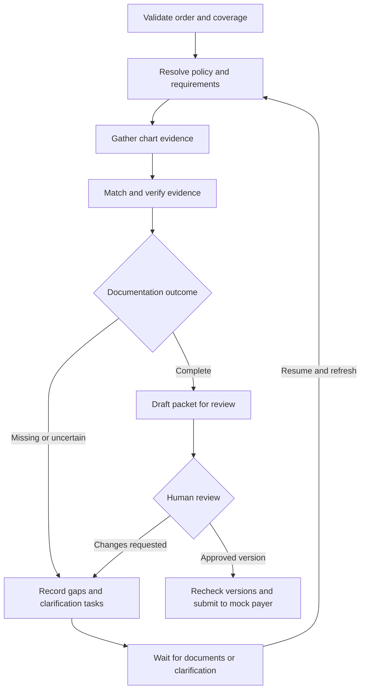

# MRI Prior Authorization Copilot

An agentic workflow that turns a physician's lumbar MRI order into a prior-authorization packet with supporting evidence, missing-documentation checks, and human review.

The copilot combines structured patient records from a FHIR API with retrieval over clinical notes and versioned payer policies. It helps authorization staff answer: **What documentation does this request require, what evidence do we have, and what still needs attention?**

**Project status:** proposed design for a personal learning project. The customer, patients, payers, policies, and operating assumptions below are fictional. Features and performance targets describe intended behavior, not an implemented product or measured results.

## 1. Customer and business problem

**Juniper Specialty Care** is a fictional outpatient medical group with two clinics, twelve clinicians, and three referral and authorization coordinators. Its physicians frequently order imaging for patients referred through primary care, orthopedics, and rehabilitation.

The group uses an electronic health record (EHR), receives outside records as PDF attachments, and works with several insurers whose documentation requirements differ. Coordinators track outstanding requests in a shared spreadsheet and assemble authorization packets manually.

The operations director wants to reduce time spent searching records and repeatedly asking clinicians for missing information. Clinicians want concise, accurate requests for clarification. Coordinators want to understand why a case is ready for review and open the evidence behind each conclusion.

| Stakeholder | What they need |
| --- | --- |
| Authorization coordinator — primary user | A case queue, a requirements checklist, cited evidence, and a clear next action. |
| Ordering clinician — reviewer | An accurate draft and specific documentation gaps that require clinical clarification. |
| Operations director — customer sponsor | Less preparation work and rework, with measurable adoption and time savings. |
| Customer integration engineer | Clear API contracts, access boundaries, and enough tracing to diagnose failures. |

**Pilot hypothesis:** for eligible cases, assisted preparation plus human review can reduce active staff time by at least 50% while maintaining documentation quality. Establish the manual baseline before evaluating this hypothesis.

## 2. The manual workflow to automate

The workflow begins after a clinician has already ordered a **routine lumbar-spine MRI without contrast**.

| Step | Current manual work | Proposed system responsibility |
| --- | --- | --- |
| 1. Review the order | Open the referral, verify the patient, procedure, ordering provider, and intended service date. | Load the order, validate required fields, and bind the case to one authorized patient. |
| 2. Check insurance | Find the patient's payer and plan, then check whether authorization is required. | Read coverage details and call a mock payer API for coverage status and authorization requirements. |
| 3. Find the policy | Locate the applicable policy and identify the documentation checklist. | Resolve payer, plan, procedure, and effective dates before retrieving policy sections. |
| 4. Search the chart | Read diagnoses, encounters, medication orders, treatment records, and attached notes. | Query structured records and retrieve relevant narrative evidence. |
| 5. Reconcile gaps | Compare documentation against the policy and ask clinicians for clarification. | Produce a requirement-by-requirement evidence table and draft focused requests for missing information. |
| 6. Assemble and review | Copy information into a packet, attach records, and obtain review. | Draft a source-linked packet and present it for correction and approval. |
| 7. Submit and track | Enter information into a payer portal and record the response. | Demonstrate approved submission and status tracking through a mock payer API. |

The main source of work is the repeated loop between steps 3–6: a policy differs, an outside treatment note is missing, or new information arrives after the packet was drafted.

## 3. MVP scope

Build one complete workflow before adding more procedures or integrations.

| Area | MVP boundary |
| --- | --- |
| Procedure | Routine lumbar MRI without contrast, represented by an explicit demo procedure identifier. |
| Customer | One fictional organization; an additional organization fixture tests access isolation. |
| Payers | Three fictional payers, one supported plan each, and two dated policy versions per payer. |
| Data | 50 synthetic patient cases with approximately 8–12 documents each; begin development with 10 cases. |
| Integrations | A local FHIR R4 server, document storage, application database, and mock payer REST API. |
| Interface | Case queue and case-detail screen with evidence, gaps, review actions, and history. |
| Outcome | A reviewed authorization packet or an actionable request for missing documentation; optional submission to the mock payer. |

Clinical necessity decisions, treatment recommendations, appeals, urgent cases, real payer submissions, and real patient data are outside this MVP. The copilot evaluates documentation against the selected fictional policy; the clinician retains clinical judgment and the payer owns the authorization decision.

## 4. Example user experience

The coordinator opens an existing order and selects **Prepare authorization**.

> Prepare the lumbar MRI authorization for synthetic patient P042, covered by Cedar Demo Health's Standard plan.

The copilot returns a checklist such as the following. These requirements are invented test fixtures, not clinical guidance or a real insurer's coverage policy.

| Fictional requirement | Evidence found | Assessment |
| --- | --- | --- |
| Signed imaging order | Order ORD-042, signed by the ordering clinician. | Documented |
| Examination documented within the policy's stated lookback period | Office note N-103, dated September 2, examination section. | Documented |
| Completed conservative-treatment course lasting at least six weeks | A therapy referral and one visit note; no record establishes the course's completion or duration. | Missing documentation |

**Case status: `MISSING_DOCUMENTATION`**

**Proposed next action:** ask the ordering team for existing documentation of the treatment course, including dates and outcome, or clarification about an applicable policy exception.

An order for therapy does not establish that therapy occurred. Missing evidence also does not establish that a patient failed a requirement. The output describes what the available records support.

When a relevant outside note arrives, the coordinator refreshes the case. The workflow retrieves the updated evidence, revises the checklist, and produces a new packet version. The reviewer can inspect source excerpts, correct the draft, and approve that specific version for mock submission.

## 5. Requirements

### Functional requirements

| ID | Requirement | Acceptance behavior |
| --- | --- | --- |
| F1 | Validate intake | Missing patient, plan, procedure, or service-date information produces a specific clarification task. Unsupported cases go to manual handling. |
| F2 | Select the applicable policy | Match exact payer, plan, procedure, and policy-effective interval. Ambiguous or absent matches block readiness. |
| F3 | Gather chart evidence | Combine patient-scoped FHIR queries with retrieval over narrative documents; retain source IDs, dates, and versions. |
| F4 | Assess documentation | For every applicable requirement, return `DOCUMENTED`, `MISSING`, `CONFLICTING`, or `NEEDS_REVIEW`, with a reason and evidence where available. |
| F5 | Preserve policy logic | Keep alternative pathways, exceptions, lookback periods, and AND/OR relationships. Ambiguous interpretation goes to review. |
| F6 | Produce useful outputs | Generate a requirements matrix, brief case summary, attachment list, and any missing-information request. |
| F7 | Support review and resumption | Persist the case across restarts and pause while awaiting documents or human review. Resume from saved state. |
| F8 | Control submission | Only a permitted reviewer can approve the current packet version. Submit through the mock API and store its receipt and status. |

### Reliability, access, and quality requirements

| Area | Required behavior |
| --- | --- |
| Access control | Derive organization, role, and allowed patient access from the authenticated session. Enforce checks at the API, tool, database, document, and checkpoint boundaries. |
| Source grounding | Every substantive clinical statement and documentation assessment links to a source excerpt or records that evidence is missing. Validate that cited sources exist and belong to the case. |
| Freshness | Record source versions and retrieval timestamps. Recheck relevant order, coverage, policy, and document changes before review and submission. |
| Poor data | Flag duplicates, conflicting dates, unreadable attachments, and missing identifiers. Surface uncertainty instead of filling gaps with plausible content. |
| Tool failures | Distinguish an unavailable source from an empty result. Retry transient failures with bounded backoff, then persist a blocked state with a retry action. |
| Replay safety | Use stable case and submission identifiers. Replayed nodes and repeated approval clicks must not create duplicate submissions. |
| Model boundaries | Treat retrieved text as evidence, not instructions. Tools accept validated arguments; the model cannot change patient scope or authorize submission. |
| Auditability | Record source versions, model/prompt versions, tool actions, packet revisions, reviewer identity, and submission results. |

`READY_FOR_REVIEW` means the supported documentation checks passed. Keep coverage status, documentation status, reviewer approval, and payer response in separate fields so an active insurance plan or completed checklist cannot be mistaken for payer approval.

## 6. Proposed high-level solution

Use **one LangGraph workflow** with explicit nodes, typed state, and a bounded evidence-search loop. Within that graph, the model can choose additional approved retrieval tools when evidence is incomplete. Deterministic code owns identity checks, date calculations, state transitions, and submission controls.

Intake or dependency failures persist a blocked status before reaching the documentation assessment. An unsupported or no-authorization-required response follows a separate manual or completed branch, respectively. These branches remain visible in the case history.

### Responsibilities inside the graph

| Component | Responsibility |
| --- | --- |
| Intake and policy resolver | Validate the order and coverage, then select the authoritative policy version using metadata. |
| Evidence researcher | Use tools such as `fetch_chart_section`, `search_notes`, and `read_document` to find supporting and conflicting evidence. Allow up to two additional retrieval rounds. |
| Evidence matcher | Extract structured observations and map them to the policy's requirements, preserving negation, dates, and uncertainty. |
| Verifier | Check citations, patient identity, source versions, requirement coverage, and deterministic date calculations; flag unsupported statements. |
| Packet writer | Draft from verified evidence and preserve links to the underlying records. |
| Review and submission handler | Pause for review, validate the approval against the packet version, and call the mock payer through an idempotent action. |

The verifier combines programmatic checks with a separate model pass for semantic support. A second model pass can still repeat the first pass's mistakes; labeled evaluation and human review remain part of the design.

Persist case identifiers, selected policy version, source manifest, requirement assessments, unresolved gaps, packet version, review decision, and submission receipt in PostgreSQL. Use a durable LangGraph checkpointer for pause/resume. A saved checkpoint does not schedule work by itself: the MVP resumes through an explicit API action from the UI. Automatic ingestion events can be added later.

LangGraph's documented interrupt mechanism supports saving state and resuming with human input. See [LangGraph interrupts](https://docs.langchain.com/oss/python/langgraph/interrupts).

## 7. Data, retrieval, and enterprise integration

### Route each question to the appropriate source

| Information | Source | Retrieval method |
| --- | --- | --- |
| Order, patient, and coverage identifiers | FHIR `ServiceRequest`, `Patient`, and `Coverage` | Exact resource lookup and reference validation. |
| Recorded diagnoses, encounters, medication orders, and procedures | FHIR `Condition`, `Encounter`, `MedicationRequest`, and `Procedure` | Structured patient-scoped queries, including pagination. |
| Narrative examination and treatment evidence | Notes and reports referenced through FHIR `DocumentReference` | Metadata filtering, keyword/vector retrieval, then source-document inspection. |
| Applicable payer requirements | Versioned fictional policy documents | Exact policy resolution followed by retrieval within the selected policy. |
| Case state and approvals | Application PostgreSQL tables | Deterministic queries and updates. |
| Current simulated coverage and authorization status | Mock payer API | Typed REST calls with explicit error handling. |

FHIR represents service orders through [ServiceRequest](https://hl7.org/fhir/R4/servicerequest.html) and provides [DocumentReference](https://hl7.org/fhir/R4/documentreference.html) for indexing documents and attachments. The adapter should respect the source resource's meaning: a medication order alone does not prove medication use.

### Ingestion and retrieval design

1. **Ingest sources.** Seed the FHIR server with curated synthetic bundles. Parse text-based notes and policy PDFs; retain originals and page/section locations. Route unreadable scans to manual handling initially.
2. **Create a policy catalog.** Store payer, plan, procedure, effective interval, version, and content hash. Extract requirements once per policy version and review them against the complete policy before activation.
3. **Index narrative content.** Split documents by meaningful sections, retaining exceptions and referenced context. Store embeddings and metadata in PostgreSQL with pgvector; use PostgreSQL full-text search alongside vector similarity.
4. **Filter before retrieval.** Apply authorized organization/patient filters for chart documents and exact policy-version filters for policy content. Revalidate permissions when opening a cited original.
5. **Build focused context.** Give each model step the applicable requirements and relevant evidence excerpts with source identifiers. Fetch surrounding text when a passage is incomplete or contradictory.

The reviewed requirement catalog ensures a top-k search cannot silently omit a mandatory requirement. Retrieval supplies relevant language and evidence; it does not define the entire checklist from whichever chunks happened to rank highest.

For this small corpus, begin with exact vector search and metadata indexes. [pgvector](https://github.com/pgvector/pgvector) supports this approach; approximate indexing can be evaluated after scale creates a need.

### Freshness and source quality

Reprocess documents when their content hash changes. Publish new chunks as one complete document version and exclude superseded versions from current retrieval while retaining authorized audit history. Deletions and permission changes must also invalidate retrieval results and cached access.

Resolve policies by their effective interval for the intended service date, following the fictional payer's explicit date rule. The most recently uploaded file is not automatically applicable. Track clinical event dates separately from upload dates.

On resume, compare the case's source manifest with current versions and rerun affected checks. Material changes invalidate prior packet approval. If a required source is unavailable or freshness cannot be established, display the dependency problem and block submission.

## 8. Proposed tech stack

| Layer | Choice | Purpose |
| --- | --- | --- |
| Frontend | React + TypeScript + Vite | Case queue, requirements table, source viewer, and review actions. |
| Backend | Python + FastAPI + Pydantic | Typed API contracts, input validation, integration adapters, and graph invocation. |
| Agent orchestration | LangGraph with PostgreSQL checkpointing | Explicit state, conditional transitions, bounded tool loops, and human review interrupts. |
| Language model | Gemini Flash-family model through the Google Gen AI SDK | Evidence extraction, tool selection, and packet drafting with structured outputs. Pin a supported model ID when implementing. |
| Embeddings | Gemini embedding model | Embed policies and narrative notes; version the model and dimensions with the index. |
| Application and retrieval data | PostgreSQL + pgvector + full-text search | Store case state, approvals, metadata, keyword indexes, and vectors in one database service. |
| Synthetic EHR | HAPI FHIR server configured for R4 | Exercise real FHIR REST requests against locally controlled synthetic resources. |
| Document storage | Local mounted directory for the MVP | Store original documents behind an authorized backend endpoint. |
| Payer integration | Small FastAPI mock service | Simulate coverage checks, authorization requirements, submission, status, and failures. |
| Observability | LangSmith initially; OpenTelemetry for API/tool spans | Inspect model and retrieval runs, then connect them to service-level traces. |
| Evaluation and CI | pytest + a labeled JSON evaluation set + GitHub Actions | Run regression cases, access tests, and workflow checks; report quality and operational metrics. |
| Local runtime | Docker Compose | Run the app, FHIR server, mock payer, and PostgreSQL reproducibly. |

Use separate databases and credentials for HAPI and the application even if they share one local PostgreSQL instance. The application integrates through FHIR APIs rather than reading HAPI's internal database tables.

Official implementation references: [Gemini structured outputs](https://ai.google.dev/gemini-api/docs/structured-output), [Gemini embeddings](https://ai.google.dev/gemini-api/docs/embeddings), and [HAPI FHIR server setup](https://hapifhir.io/hapi-fhir/docs/server_jpa/get_started.html).

**Later learning extensions:** expose the existing read tools through an MCP server; compare an independently prompted evidence agent with the single-graph baseline; or deploy the API on Google Cloud with managed database and document storage. Each extension should preserve the same access checks and evaluation set.

## 9. Evaluation and observability

Author gold labels alongside the synthetic cases: applicable policy, complete requirement set, relevant source passages, gaps, and expected disposition. Keep 30 cases for development and 20 held out, split by patient and document lineage. Report counts with rates; this small dataset supports project iteration, not a production-quality claim.

| Dimension | Measurement |
| --- | --- |
| Policy selection | Exact applicable-policy/version accuracy; wrong-plan and expired-policy cases included. |
| Retrieval | Recall@5 over labeled evidence passages, with relevance checked within the authorized patient and policy scope. |
| Grounding | Citation precision: the fraction of cited passages that actually support the attached claim. |
| Missing evidence | Recall of labeled missing requirements; separately count incomplete cases incorrectly marked ready. |
| Workflow correctness | Expected disposition, successful pause/resume, approval invalidation, and duplicate-submission prevention. |
| Access boundaries | Wrong-patient and cross-organization attempts blocked before content enters model context or output. |
| Operational behavior | p50/p95 active processing latency, tokens, estimated model cost per case, retries, and dependency failures. |

Initial acceptance goals: no access leakage or duplicate submissions in the test suite; no incomplete held-out case incorrectly marked ready; at least 95% citation precision and missing-evidence recall. Treat these as proposed gates and report failures transparently. Benchmark latency and cost before setting tighter budgets; exclude time waiting for humans from model-processing latency.

Include cases with negation, a therapy referral without completion evidence, contradictory notes, missing policy matches, changed policies, unreadable documents, injected instructions inside notes, and API timeouts. Test approval followed by a changed order or newly received document.

Trace each case through policy selection, retrieval, model calls, verification, and review. Record tool arguments within permitted scope, source IDs/versions, prompt/model versions, token counts, duration, retry count, and error category. Use concise evidence assessments for debugging; do not depend on hidden model reasoning.

## 10. Customer discovery, pilot, and build sequence

Before a real pilot, shadow coordinators preparing several representative requests. Establish what they count as a complete packet, who owns each clarification task, which systems contain authoritative records, and where outside records enter the process. Review the checklist and exception handling with the clinician and integration engineer.

Measure **active staff minutes per case**, clarification cycles, first-review completeness, and the share of eligible cases where coordinators use the copilot. Keep payer decision time separate from preparation time. A personal demo can measure task completion and simulated review; real customer adoption and ROI would require an actual pilot.

For illustration only, 300 cases per month reduced from 25 to 10 active staff minutes each would save **75 staff hours per month**. The assisted time must include review and corrections; this is a planning calculation, not an observed result.

| Milestone | Deliverable and completion check |
| --- | --- |
| 1. Define the case | Ten synthetic patients, one payer policy, and hand-checked labels for complete and incomplete requests. |
| 2. Build retrieval | FHIR adapter, document ingestion, policy selection, and cited evidence retrieval for one case. |
| 3. Complete the workflow | Persisted graph, gap handling, packet draft, review interrupt, and successful restart/resume. |
| 4. Add integration failures | Mock payer submission, idempotency, dependency errors, policy updates, and approval invalidation. |
| 5. Evaluate the MVP | Expand to three payers and 50 cases; run the held-out evaluation and inspect failure traces. |
| 6. Demonstrate the product | Show an incomplete case, add the missing record, resume, review the updated packet, and submit once to the mock payer. |

The finished demo should make the entire case inspectable: the order that started it, the applicable policy, the evidence used, the unresolved questions, the human decision, and the recorded outcome.
